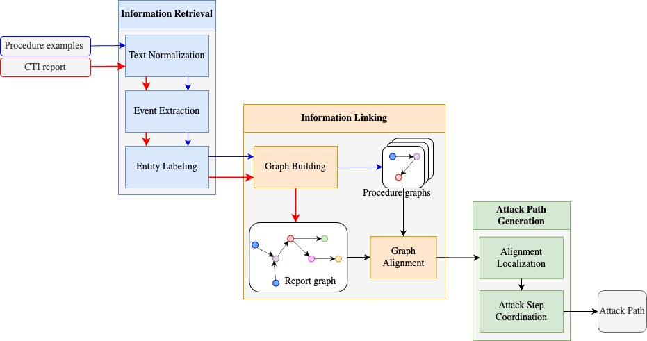
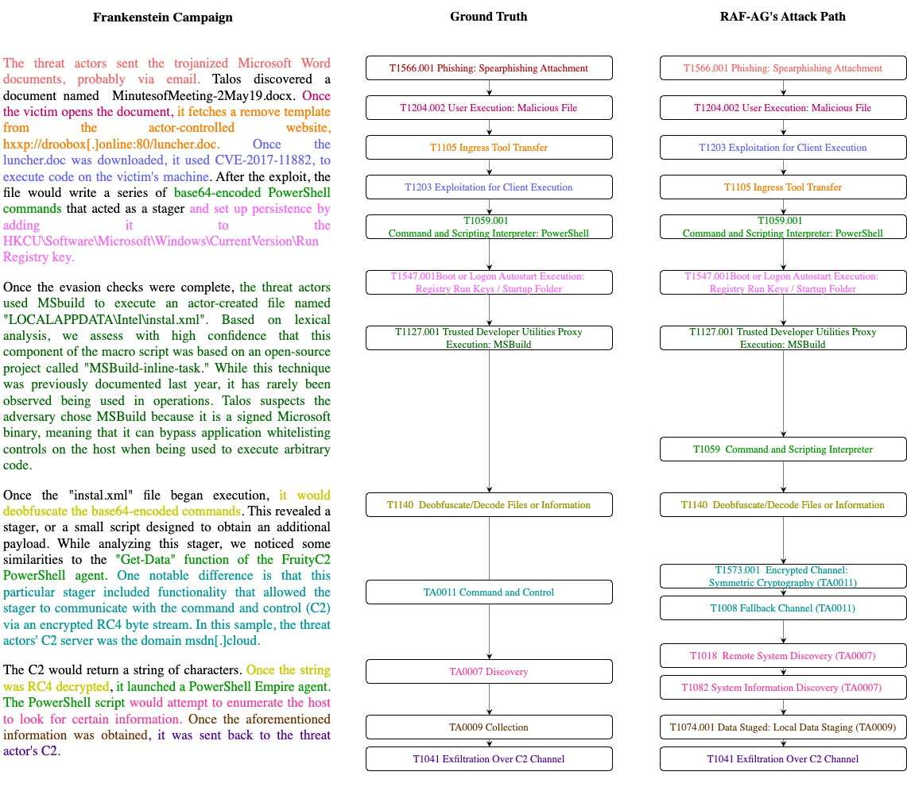

# ThreatPathMapper: Advanced Attack Path Visualization & Analysis

> This project is based on the original [RAF-AG research by CyberLab](https://github.com/cyb3rlab/RAF-AG)  
> Enhanced with advanced visualization and multi-format attack chain analysis capabilities

ThreatPathMapper is an AI-powered cybersecurity framework that automatically processes threat intelligence reports and generates structured attack paths mapped to the MITRE ATT&CK framework. Rather than requiring manual analysis, ThreatPathMapper uses graph-based knowledge matching to transform unstructured threat intelligence content into actionable attack intelligence with professional visualization capabilities.

## Key Features

### **Core Capabilities:**
1. **Automated Attack Path Generation**: Converts threat intelligence reports into sequential attack chains
2. **MITRE ATT&CK Mapping**: Automatically identifies and maps techniques to the MITRE framework
3. **Graph-based Analysis**: Uses knowledge graphs for semantic understanding of attack narratives
4. **Multi-format Visualization**: Generates attack chains in multiple formats for different audiences

### ThreatPathMapper Enhanced Features:
- **Kill Chain Structure**: Organizes techniques by MITRE ATT&CK tactic phases
- **Attack Path Analysis**: Shows primary and alternative attack progressions
- **Multiple Output Formats**: Simple flow, narrative story, tabular summary, and detailed analysis
- **Confidence Scoring**: Provides probability scores for each technique identification
- **Interactive Analysis**: Comprehensive technique descriptions with implementation methods and tools

### ThreatPathMapper Enhancements Over Original RAF-AG:
- **4 Visualization Formats**: Executive summaries, technical analysis, narratives, and structured tables
- **Enhanced MITRE Mapping**: Expanded technique-to-tactic mappings with 200+ techniques
- **Kill Chain Analysis**: Professional-grade attack progression visualization
- **Multi-audience Output**: Formats tailored for executives, analysts, and technical teams
- **Improved Documentation**: Comprehensive setup guides and troubleshooting
- **Export Capabilities**: CSV, JSON, and console output options
- **Performance Optimization**: Memory management and Docker improvements

The figure below shows an overview of the underlying RAF-AG architecture. In ThreatPathMapper, text data from MITRE ATT&CK (e.g., procedure examples) are transformed into graphs (the blue path). The graphs will establish the framework's knowledge base. ThreatPathMapper takes CTI reports as its main input. These CTI reports will also be transformed into graphs (the red path).
To analyze a specific report and generate its attack path (the black path), we conduct a graph alignment between the report graph and the framework's internal graphs. After that, the graph alignment results will be decoded into the attack paths. 



Example of input and output of the framework:


## Table of Contents

- [Architecture Overview](#architecture-overview)
- [Installation](#installation)
  - [Option 1: Docker Setup (Recommended)](#option-1-docker-setup-recommended)
  - [Option 2: Local Installation](#option-2-local-installation)
  - [Option 3: Virtual Environment Setup](#option-3-virtual-environment-setup)
- [Quick Start](#quick-start)
- [Enhanced Attack Chain Analysis](#enhanced-attack-chain-analysis)
  - [Kill Chain Visualization](#kill-chain-visualization)
  - [Multiple Output Formats](#multiple-output-formats)
  - [Usage Examples](#usage-examples)
- [Code Hierarchy](#code-hierarchy)
- [Data Hierarchy](#data-hierarchy)
- [Advanced Examples](#advanced-examples)
- [Performance and Troubleshooting](#performance-and-troubleshooting)
- [Comparison with Other Tools](#comparison-with-other-tools)
- [Dataset](#dataset)
- [Acknowledgements](#acknowledgements)

## Architecture Overview

### System Architecture

ThreatPathMapper uses a graph-based knowledge matching approach that differs from traditional keyword-based tools:

```
CTI Reports → NLP Processing → Graph Alignment → Attack Path Generation → Multi-format Visualization
```

**Key Components:**
- **Knowledge Base**: MITRE ATT&CK framework converted to searchable knowledge graphs
- **NLP Engine**: SpaCy-based parsing for semantic understanding
- **Graph Alignment**: Matches report content against MITRE technique patterns
- **Path Generation**: Reconstructs chronological attack sequences
- **Visualization Layer**: Multiple output formats for different audiences

**Technology Stack:**
- **NLP**: SpaCy, TensorFlow Hub embeddings
- **Graph Processing**: NetworkX for knowledge graph operations
- **Machine Learning**: TensorFlow for semantic similarity
- **Visualization**: Custom Python formatting and tabulation

### How ThreatPathMapper Works

1. **Input**: Technical blogs, threat reports, incident analyses
2. **Processing**: Converts text into structured knowledge graphs
3. **Matching**: Finds semantic similarities with MITRE ATT&CK patterns
4. **Sequencing**: Reconstructs attack timeline from narrative flow
5. **Output**: Structured kill chains with confidence scores

---

## Installation

### Option 1: Docker Setup (Recommended)

Docker provides the easiest and most consistent way to run ThreatPathMapper across all platforms (Windows, macOS, Linux).

#### Prerequisites
- [Docker](https://docs.docker.com/get-docker/) installed on your system
- [Docker Compose](https://docs.docker.com/compose/install/) (usually included with Docker Desktop)

#### Build and Run with Docker

1. **Clone the repository:**
   ```bash
   git clone <repository-url>
   cd ThreatPathMapper
   ```

2. **Unzip required data files:**
   ```bash
   # Unzip all data files in the data folder
   unzip "data/procedure.zip" -d "data/"
   unzip "data/technique.zip" -d "data/"
   # Add other zip files as needed
   ```

3. **Build the Docker image:**
   ```bash
   docker-compose build
   ```

4. **Run the container:**
   ```bash
   # Run in detached mode
   docker-compose up -d
   
   # Or run interactively
   docker-compose run --rm threatpathmapper /bin/bash
   ```

5. **Access the container (if running detached):**
   ```bash
   docker-compose exec threatpathmapper /bin/bash
   ```

6. **Inside the container, run the framework:**
   ```bash
   python3 main.py
   ```

### Option 2: Local Installation

#### Prerequisites for All Platforms

- **Python 3.8 or higher**
- **Git** (for cloning the repository)

#### Windows Setup

1. **Install Python:**
   - Download from [python.org](https://www.python.org/downloads/)
   - During installation, check "Add Python to PATH"

2. **Clone and setup:**
   ```cmd
   git clone <repository-url>
   cd ThreatPathMapper
   python -m venv attakpathenv
   attakpathenv\Scripts\activate
   pip install -r requirements.txt
   ```

3. **Install SpaCy models:**
   ```cmd
   python -m spacy download en_core_web_lg
   python -m spacy download en_core_web_trf
   python -m coreferee install en
   ```

#### macOS Setup

1. **Install Python using Homebrew (recommended):**
   ```bash
   # Install Homebrew if not already installed
   /bin/bash -c "$(curl -fsSL https://raw.githubusercontent.com/Homebrew/install/HEAD/install.sh)"
   
   # Install Python
   brew install python
   ```

2. **Clone and setup:**
   ```bash
   git clone <repository-url>
   cd ThreatPathMapper
   python3 -m venv attakpathenv
   source attakpathenv/bin/activate
   pip install -r requirements.txt
   ```

3. **Install SpaCy models:**
   ```bash
   python -m spacy download en_core_web_lg
   python -m spacy download en_core_web_trf
   python -m coreferee install en
   ```

#### Linux Setup (Ubuntu/Debian)

1. **Install Python and dependencies:**
   ```bash
   sudo apt update
   sudo apt install python3 python3-pip python3-venv git build-essential
   ```

2. **Clone and setup:**
   ```bash
   git clone <repository-url>
   cd ThreatPathMapper
   python3 -m venv attakpathenv
   source attakpathenv/bin/activate
   pip install -r requirements.txt
   ```

3. **Install SpaCy models:**
   ```bash
   python -m spacy download en_core_web_lg
   python -m spacy download en_core_web_trf
   python -m coreferee install en
   ```

#### Linux Setup (CentOS/RHEL/Fedora)

1. **Install Python and dependencies:**
   ```bash
   # CentOS/RHEL
   sudo yum install python3 python3-pip python3-venv git gcc gcc-c++ make
   
   # Fedora
   sudo dnf install python3 python3-pip python3-venv git gcc gcc-c++ make
   ```

2. **Follow the same steps as Ubuntu from step 2 onwards**

#### Data Preparation (All Platforms)

After installation, unzip the required data files:

```bash
# Navigate to the data directory
cd data

# Unzip all required data files
unzip procedure.zip
unzip technique.zip
# Add other zip files as present in your data folder

# Verify the data structure
ls -la procedure/
ls -la technique/
```

### Option 3: Virtual Environment Setup

For users experiencing Docker issues or wanting lightweight local setup:

```bash
# Create virtual environment
python3 -m venv venv
source venv/bin/activate  # On Windows: venv\Scripts\activate

# Install dependencies
pip install tabulate

# Install other ThreatPathMapper dependencies as needed
pip install -r requirements.txt

# Install SpaCy models
python -m spacy download en_core_web_lg
python -m spacy download en_core_web_trf
python -m coreferee install en
```

---

## Quick Start

### Basic Usage

1. **Prepare your CTI reports:**
   - Place your CTI reports (in `.txt` format) in `data/campaign/input/` folder
   - Each report should be a single text file
   - The filename will be used as the campaign ID

2. **Run the analysis:**

   **Using Docker:**
   ```bash
   docker-compose exec threatpathmapper python3 main.py
   ```

   **Using local installation:**
   ```bash
   # Activate virtual environment first
   source attakpathenv/bin/activate  # On Linux/macOS
   # OR
   attakpathenv\Scripts\activate     # On Windows
   
   # Run ThreatPathMapper
   python3 main.py
   ```

3. **View results:**
   - Analysis results will be saved in `data/campaign/decoding_result/`
   - Each report will have a corresponding JSON file with the same name

### Advanced Usage with Parameters

You can customize the analysis with various parameters:

```bash
# Full analysis from scratch
python3 main.py --campaign_from_0=True --procedure_from_0=True --technique_from_0=True

# Skip certain preprocessing steps (faster for multiple runs)
python3 main.py --campaign_from_0=True --procedure_from_0=False --technique_from_0=False

# Run with different configurations
python3 main.py --techniue_alignment_from_0=True
```

## Enhanced Attack Chain Analysis

ThreatPathMapper features a comprehensive **Enhanced Attack Chain Analysis System** that generates multiple visualization formats for different audiences and use cases.

### Kill Chain Visualization

The enhanced system organizes attack techniques by **MITRE ATT&CK tactic phases**, similar to professional threat intelligence reports:

```
TA0001 - INITIAL ACCESS
  1. T1566.001 - Spearphishing Attachment (Confidence: 0.911)
  2. T1190 - Exploit Public-Facing Application (Confidence: 0.876)

TA0002 - EXECUTION  
  1. T1059.001 - PowerShell (Confidence: 1.000)
  2. T1059.003 - Windows Command Shell (Confidence: 0.944)
```

### Multiple Output Formats

The system automatically generates **4 different visualization formats**:

#### **1. Simple Attack Flow** (Executive Summary)
```
Resource Development → Initial Access → Execution → Persistence → 
Privilege Escalation → Defense Evasion → Credential Access → Discovery → 
Lateral Movement → Collection → Command and Control → Exfiltration
```

#### **2. Attack Story** (Narrative Format)
```
Complete Attack Narrative:
1. Attackers develop malware for the attack
2. Exploit public-facing application to gain access  
3. Execute PowerShell commands
4. Establish persistence via remote services
5. Escalate privileges using accessibility features
...
```

#### **3. Attack Summary Table** (Clean Tabular)
```
Phase                Technique    Action                                    Confidence
Resource Development T1588.001    Develop malware for the attack           1.000     
Initial Access       T1190        Exploit public-facing application        0.994     
Execution            T1059.001    Execute PowerShell commands              1.000     
```

#### **4. Detailed Technical Analysis** (Security Teams)
Complete technical breakdown with:
- Technique descriptions and implementation methods
- Associated tools and software
- Observed indicators from the campaign
- Confidence bars and scoring
- Primary and alternative attack paths

### Usage Examples

#### **Basic Analysis:**
```bash
# Using Docker
docker-compose exec threatpathmapper python generate_tabular_data.py "data/campaign/decoding_result/Your_Campaign.json"

# Using virtual environment
source venv/bin/activate
python generate_tabular_data.py "data/campaign/decoding_result/Your_Campaign.json"
```

#### **Export to Multiple Formats:**
```bash
# Generate CSV and JSON exports
python generate_tabular_data.py "data/campaign/decoding_result/Your_Campaign.json" \
    --save-csv --save-json --output-dir enhanced_output

# Silent mode (no console output)
python generate_tabular_data.py "data/campaign/decoding_result/Your_Campaign.json" \
    --save-csv --no-print --output-dir reports
```

#### **Batch Processing:**
```bash
# Process multiple campaigns
for file in data/campaign/decoding_result/*.json; do
    python generate_tabular_data.py "$file" --save-csv --output-dir batch_results
done
```

### Command Line Options

| Option | Description |
|--------|-------------|
| `input_file` | Path to RAF-AG JSON result file (required) |
| `--output-dir, -o` | Directory to save output files |
| `--save-csv` | Export results as CSV file |
| `--save-json` | Export results as JSON file |
| `--no-print` | Skip console output (silent mode) |

### Output Features

**Enhanced Data Columns:**
- **Kill Chain Structure**: Organized by MITRE ATT&CK tactic phases
- **Attack Progression**: Shows logical flow between techniques
- **Confidence Scoring**: Visual confidence bars and numerical scores
- **Implementation Details**: Methods, tools, and observed indicators
- **Multi-Path Analysis**: Primary and alternative attack routes

## Code Hierarchy

### Architecture Overview

ThreatPathMapper follows a modular, object-oriented design with clear separation of concerns:

```
ThreatPathMapper/
├── classes/           # Core analysis components
├── data/             # Knowledge base and campaign data
├── main.py           # Primary analysis engine
├── generate_tabular_data.py  # Enhanced visualization system
└── docker-compose.yml # Deployment configuration
```

### Core Classes (`classes/`)

**NLP and Text Processing:**
- **`sentence.py`**: Dependency tree analysis and cybersecurity event extraction
- **`paragraph.py`**: Document structure representation with sentence collections
- **`preprocessings.py`**: Text cleaning and normalization functions
- **`subject_verb_object_extract.py`**: Grammar-based relation extraction

**Knowledge Representation:**
- **`procedure.py`**: MITRE ATT&CK procedure examples (inherits from paragraph)
- **`campaign.py`** / **`big_campaign.py`**: CTI report representation classes
- **`technique.py`**: MITRE ATT&CK technique modeling

**Analysis Engines:**
- **`cosine_similarity.py`**: Semantic similarity calculations using embeddings
- **`alignment_multiprocessing.py`**: Parallel processing for graph alignment
- **`decoder.py`**: Attack path reconstruction from alignment results

**Specialized Components:**
- **`ner_model.py`**: Named Entity Recognition for cybersecurity entities
- **`heuristic_model.py`**: Rule-based technique identification
- **`finalizing.py`**: Result aggregation and confidence scoring

### Main Scripts

**Core Analysis:**
- **`main.py`**: Primary RAF-AG analysis engine and orchestrator
- **`mitre_attack.py`**: MITRE ATT&CK STIX data processing and extraction
- **`language_models.py`**: NLP model initialization and management

**Enhanced Visualization:**
- **`generate_tabular_data.py`**: Enhanced attack chain analysis system
  - Kill chain structure visualization
  - Multi-format output generation
  - Attack path progression analysis
  - Comprehensive technique descriptions

**Configuration and Utilities:**
- **`keys.py`**: Framework hyperparameters and configuration settings
- **`modules.py`** / **`utils.py`**: Supporting utilities and helper functions

### Data Structure (`data/`)

**Campaign Processing Pipeline:**
```
data/campaign/
├── input/                    # CTI reports (txt, html, pdf)
├── output/                   # Processed campaign graphs
├── procedure_alignment/      # Technique matching results
├── tech_alignment/           # Technical alignment data
├── decoding_result/         # Final attack paths (JSON)
└── USE_cosine/              # Cached similarity computations
```

**Knowledge Base:**
```
data/
├── procedure/               # MITRE ATT&CK procedure examples
├── technique/               # MITRE ATT&CK technique definitions  
├── metadata/                # Framework metadata and verb similarities
├── patterns/                # Regex patterns for entity extraction
└── dictionarydata/          # Weak supervision dictionaries
```

### Deployment Configuration

- **`Dockerfile`** / **`Dockerfile.ssl-fix`**: Container definitions with SSL handling
- **`docker-compose.yml`**: Multi-service orchestration configuration
- **`requirements.txt`**: Python package dependencies and versions
- **`.dockerignore`**: Optimized container build exclusions

## Data Hierarchy

### Understanding ThreatPathMapper's Data Flow

ThreatPathMapper processes data through multiple stages, each with specific purposes:

```
CTI Reports → Graph Processing → Alignment → Attack Path Generation → Visualization
```

### Campaign Processing Pipeline (`data/campaign/`)

**Input Stage:**
- **`input/`**: Your CTI reports in various formats
  - `.txt`: Plain text threat intelligence reports
  - `.html`: Web-based threat reports (blogs, articles)
  - `.pdf`: Research papers and formal reports
  - Filename becomes the campaign identifier

**Processing Stages:**
- **`output/`**: Structured graph representations (`.jsonl` format)
  - Converts unstructured text into graph format
  - Maintains relationships between entities and actions

- **`procedure_alignment/`**: Technique matching results
  - Shows how report content aligns with MITRE procedures
  - Raw alignment scores and mappings

- **`tech_alignment/`**: Technical alignment refinements
  - Enhanced technique identification
  - Confidence scoring and validation

**Final Results:**
- **`decoding_result/`**: Complete attack paths (JSON format)
  - Use these files with `generate_tabular_data.py`
  - Contains sequential attack chains
  - Includes confidence scores and technique details

**Performance Optimization:**
- **`USE_cosine/`**: Cached semantic similarity computations
  - Speeds up repeated analysis
  - Stores embedding calculations

### Knowledge Base (`data/procedure/` & `data/technique/`)

**MITRE ATT&CK Integration:**
- **`procedure/input/`**: Raw MITRE ATT&CK procedure examples
- **`procedure/output/`**: Individual procedure knowledge graphs
- **`procedure/deduplication/`**: Merged similar procedures for efficiency
- **`analyzed_procedure.jsonl`**: Optimized procedure data for fast loading

**Technique Definitions:**
- **`technique/`**: MITRE ATT&CK technique descriptions and metadata
- **`patterns/`**: Regex patterns for cybersecurity entity recognition
- **`metadata/`**: Framework configuration and similarity matrices

### Supporting Data Resources

**Dictionary-based Learning:**
- **`dictionarydata/`**: Weak supervision dictionaries
  - `Actor.json`: Threat actor names and aliases
  - `Malware.json`: Malware family identifiers
  - `Tool.json`: Attack tool references

**Configuration and Optimization:**
- **`patterns/`**: Domain-specific extraction patterns
- **`metadata/`**: Performance tuning and similarity data

### Workflow Integration

**For New Users:**
1. Place reports in `data/campaign/input/`
2. Run `python main.py`
3. Use results from `data/campaign/decoding_result/`
4. Generate visualizations with `generate_tabular_data.py`

**For Advanced Users:**
- Monitor intermediate results in alignment folders
- Customize patterns and dictionaries for specific domains
- Optimize performance using cached similarity data
- Batch process multiple campaigns efficiently

**Data Persistence:**
- All intermediate results are preserved for analysis
- Cached computations improve subsequent runs
- Results can be exported in multiple formats for integration

## Advanced Examples

### Example 1: Complete Threat Intelligence Analysis

**Step 1: Prepare CTI Report**
```bash
# Add your threat intelligence report
cp typhoon_apt_report.html data/campaign/input/

# Or use text format
echo "The Typhoon APT group used spearphishing emails with malicious Office documents..." > data/campaign/input/typhoon_analysis.txt
```

**Step 2: Run RAF-AG Analysis**
```bash
# Using Docker
docker-compose exec threatpathmapper python3 main.py --campaign_from_0=True

# Using local environment
source venv/bin/activate
python3 main.py --campaign_from_0=True
```

**Step 3: Generate Enhanced Attack Chain Analysis**
```bash
# Full analysis with all visualization formats
python generate_tabular_data.py "data/campaign/decoding_result/typhoon_analysis.json"

# Export for reporting
python generate_tabular_data.py "data/campaign/decoding_result/typhoon_analysis.json" \
    --save-csv --save-json --output-dir reports/typhoon_analysis
```

**Expected Output:**
- Kill chain structure organized by MITRE ATT&CK tactics
- Simple attack flow for executive summaries
- Attack narrative for documentation
- Technical analysis for security teams
- CSV/JSON exports for further analysis

### Example 2: Batch Processing Threat Intelligence

**Process Multiple APT Reports:**
```bash
#!/bin/bash
# Enterprise threat intelligence processing

# Prepare multiple reports
cp apt29_report.html data/campaign/input/
cp lazarus_analysis.pdf data/campaign/input/  
cp carbanak_incident.txt data/campaign/input/

# Run batch analysis
python3 main.py --campaign_from_0=True

# Generate comprehensive reporting
mkdir -p threat_intelligence_reports
for result_file in data/campaign/decoding_result/*.json; do
    campaign_name=$(basename "$result_file" .json)
    echo "Processing $campaign_name attack chain..."
    
    # Generate all formats
    python generate_tabular_data.py "$result_file" \
        --save-csv --save-json \
        --output-dir threat_intelligence_reports/$campaign_name
done

echo "Complete threat intelligence analysis ready!"
```

### Example 3: Integration with Security Operations

**Automated CTI Processing Pipeline:**
```bash
#!/bin/bash
# SOC Integration Script

CTI_INPUT_DIR="data/campaign/input"
REPORTS_DIR="security_reports"
DATE=$(date +%Y%m%d)

echo "Starting daily CTI processing - $DATE"

# 1. Process new threat intelligence
if [ "$(ls -A $CTI_INPUT_DIR)" ]; then
    echo "Found new CTI reports, processing..."
    python3 main.py --campaign_from_0=True
    
    # 2. Generate security reports
    mkdir -p $REPORTS_DIR/$DATE
    
    for result_file in data/campaign/decoding_result/*.json; do
        campaign_name=$(basename "$result_file" .json)
        
        # Executive summary (simple flow)
        python generate_tabular_data.py "$result_file" \
            --save-csv --output-dir $REPORTS_DIR/$DATE/executive
        
        # Technical analysis (detailed)
        python generate_tabular_data.py "$result_file" \
            --save-json --output-dir $REPORTS_DIR/$DATE/technical
            
        echo "Generated reports for: $campaign_name"
    done
    
    echo "Daily CTI processing complete!"
    echo "Reports available in: $REPORTS_DIR/$DATE/"
else
    echo "No new CTI reports found"
fi
```

### Example 4: Academic Research Usage

**Research Dataset Analysis:**
```bash
# Process research dataset
python3 main.py --campaign_from_0=True

# Generate research-friendly outputs
for result_file in data/campaign/decoding_result/*.json; do
    campaign_name=$(basename "$result_file" .json)
    
    # Research data export
    python generate_tabular_data.py "$result_file" \
        --save-csv --save-json \
        --output-dir research_data/$campaign_name
        
    echo "Research data generated for: $campaign_name"
done

# Aggregate results for statistical analysis
echo "Campaign,Primary_Tactic,Technique_Count,Avg_Confidence" > research_summary.csv
# Additional processing scripts can analyze the JSON outputs
```

## Performance and Troubleshooting

### Performance Optimization

**Memory Management:**
```bash
# For large CTI reports, increase Docker memory
docker-compose run --rm -m 8g threatpathmapper python3 main.py

# Disable multiprocessing for memory-constrained environments
python3 main.py --multiprocessing=False

# Process files individually for very large datasets
python3 main.py --campaign_from_0=True --single_file=target_report.html
```

**Processing Large HTML Files:**
```bash
# Pre-process HTML to extract main content
# Remove embedded files, scripts, and styling
# Keep only threat intelligence narrative

# Monitor processing resources
docker stats  # Monitor Docker resource usage
htop         # Monitor system resources
```

### Common Issues and Solutions

#### **1. Process Killed / Memory Issues**
```bash
# Issue: Process terminates with "Killed" message
# Solution: Increase available memory

# Docker approach:
docker-compose down
# Edit docker-compose.yml to add:
# deploy:
#   resources:
#     limits:
#       memory: 8G
docker-compose up --build

# Local approach:
# Close other applications
# Use virtual environment instead of Docker
source venv/bin/activate
python3 main.py
```

#### **2. Dependency Issues**
```bash
# Virtual environment setup
python3 -m venv venv
source venv/bin/activate
pip install tabulate spacy tensorflow-hub
python -m spacy download en_core_web_lg
python -m spacy download en_core_web_trf
```

#### **3. Docker Build Issues**
```bash
# Clear Docker cache and rebuild
docker system prune -f
docker-compose build --no-cache

# Use local environment if Docker issues persist
source venv/bin/activate
python generate_tabular_data.py "data/campaign/decoding_result/Your_Campaign.json"
```

#### **4. Empty or Invalid Results**
```bash
# Verify input file format
ls -la data/campaign/input/

# Check processing logs for errors
tail -f processing.log

# Test with smaller sample file first
echo "Simple APT attack using spearphishing" > data/campaign/input/test.txt
python3 main.py
```

### Debugging Tips

**Monitor Processing:**
```bash
# Watch processing progress
tail -f data/campaign/output/*.log

# Check intermediate results
ls -la data/campaign/procedure_alignment/
ls -la data/campaign/tech_alignment/
```

**Validate Results:**
```bash
# Check if analysis completed
ls -la data/campaign/decoding_result/

# Verify JSON structure
jq '.' data/campaign/decoding_result/your_campaign.json | head -20
```

---

## Comparison with Original RAF-AG and Other Tools

### ThreatPathMapper vs Original RAF-AG Research

ThreatPathMapper builds upon the foundational RAF-AG research by CyberLab, adding significant enhancements for operational use:

| Feature | **Original RAF-AG** | **ThreatPathMapper** |
|---------|-------------------|--------------------|
| **Core Algorithm** | Graph-based knowledge matching | Same core algorithm with optimizations |
| **Output Format** | JSON attack paths | 4 visualization formats + JSON/CSV export |
| **Visualization** | Basic JSON structure | Kill chain analysis, narratives, executive summaries |
| **User Experience** | Research-focused | Multiple audiences (executives, analysts, technical teams) |
| **Documentation** | Academic paper focus | Comprehensive setup guides and troubleshooting |
| **Deployment** | Local setup only | Docker containerization + local options |
| **Performance** | Basic implementation | Memory optimization and multiprocessing support |
| **Data Export** | JSON only | CSV, JSON, console output with formatting |
| **Attack Chain Analysis** | Sequential technique identification | Tactical phase organization with confidence visualization |
| **Practical Usage** | Proof of concept | Production-ready with batch processing |

### Key Improvements Over RAF-AG

**Enhanced Visualization System:**
- Simple attack flow diagrams for executive briefings
- Detailed technical analysis with implementation methods
- Attack narrative stories for documentation
- Structured tabular summaries for reporting

**Operational Enhancements:**
- Docker containerization for consistent deployment
- Batch processing capabilities for multiple campaigns
- Memory management for large CTI reports
- Comprehensive error handling and troubleshooting guides

**User Experience Improvements:**
- Multi-audience output formats
- Professional confidence scoring visualization
- Export capabilities for integration with other tools
- Extensive documentation and usage examples

### ThreatPathMapper vs Other CTI Tools

#### vs TRAM (Technique Recognition and Mapping)

| Aspect | **ThreatPathMapper** | **TRAM** |
|--------|--------------------|---------|
| **Approach** | Graph-based knowledge matching | Machine learning classification |
| **Focus** | Complete attack path reconstruction | Individual technique identification |
| **Output** | Sequential attack chains with narrative flow | Technique tags with probability scores |
| **Training Data** | Uses MITRE ATT&CK procedures (unsupervised) | Requires labeled training datasets |
| **Analysis Depth** | Understands relationships and attack progression | Classifies individual sentences or paragraphs |
| **Use Case** | Operational threat intelligence and incident response | Research and bulk technique tagging |
| **Visualization** | Multiple formats for different audiences | Basic technique identification results |

#### vs Commercial Threat Intelligence Platforms

| Feature | **ThreatPathMapper** | **Commercial TI Platforms** |
|---------|--------------------|--------------------------|
| **Cost** | Open source and free | Subscription-based, expensive |
| **Customization** | Full source code access | Limited customization options |
| **Attack Path Analysis** | Automated graph-based reconstruction | Manual analysis or rule-based systems |
| **MITRE Mapping** | Comprehensive automated mapping | Varies by vendor, often manual |
| **Data Sources** | Any CTI report format | Vendor-specific feeds and formats |
| **Deployment** | Self-hosted with full control | Cloud-based SaaS models |
| **Integration** | Export to standard formats | Vendor-specific APIs |

### When to Choose ThreatPathMapper

**Ideal Use Cases:**
- Organizations needing automated attack path analysis
- Security teams analyzing APT campaigns and incident reports
- Research institutions studying attack methodologies
- Companies requiring customizable threat intelligence processing
- Teams wanting to understand attack progression and relationships
- Environments requiring self-hosted, air-gapped analysis capabilities

**Advantages Over Alternatives:**
1. **Complete Attack Storylines**: Unlike tools that identify isolated techniques, ThreatPathMapper reconstructs the full attack narrative
2. **No Training Data Required**: Uses unsupervised learning based on MITRE ATT&CK knowledge
3. **Multiple Visualization Formats**: Serves different audiences from executives to technical analysts
4. **Open Source Flexibility**: Full customization and integration capabilities
5. **Operational Focus**: Designed for real-world security operations, not just research
6. **Cost-Effective**: No licensing fees or subscription costs

## Dataset

### Research Dataset

ThreatPathMapper includes a comprehensive research dataset for validation and benchmarking:

**Dataset Contents (`Dataset.zip`):**
- **30 Real-world CTI Reports**: Collected from leading threat intelligence sources
  - APT campaign analyses
  - Malware family reports  
  - Incident response summaries
  - Threat actor profiles

- **Expert-validated Ground Truth**: Manual annotations by cybersecurity professionals
  - MITRE ATT&CK technique mappings
  - Attack sequence validation
  - Confidence assessments

- **Reference Outputs**: Expected analysis results for validation
  - Attack path examples
  - Kill chain structures
  - Performance benchmarks

### Dataset Applications

**Academic Research:**
- Benchmark automated threat intelligence analysis
- Compare ThreatPathMapper with other CTI processing tools
- Validate graph-based knowledge matching approaches

**Tool Development:**
- Test new visualization formats
- Validate technique identification accuracy
- Benchmark processing performance

**Training and Education:**
- Learn threat intelligence analysis methodologies
- Understand MITRE ATT&CK framework applications
- Practice with real-world attack scenarios

### Dataset Statistics

- **Report Sources**: 15+ threat intelligence providers
- **Technique Coverage**: 200+ unique MITRE ATT&CK techniques
- **Attack Families**: Major APT groups and malware families
- **Validation Quality**: Expert-reviewed with inter-annotator agreement
- **Update Frequency**: Quarterly additions of new campaigns

**Usage Guidelines:**
- Dataset provided for research and educational purposes
- Cite ThreatPathMapper in publications using this dataset
- Respect original source attributions and licenses
- Contact maintainers for commercial usage discussions

## Example Output

Here's what ThreatPathMapper generates from a typical threat intelligence report:

### Kill Chain Structure
```
TA0001 - INITIAL ACCESS
  1. T1566.001 - Spearphishing Attachment (Confidence: 0.911)
  2. T1190 - Exploit Public-Facing Application (Confidence: 0.876)

TA0002 - EXECUTION
  1. T1059.001 - PowerShell (Confidence: 1.000)
  2. T1059.003 - Windows Command Shell (Confidence: 0.944)
```

### Simple Attack Flow
```
Resource Development → Initial Access → Execution → Persistence → 
Credential Access → Discovery → Lateral Movement → Collection → 
Command and Control → Exfiltration
```

### Attack Narrative
```
1. Attackers develop malware for the attack
2. Send spearphishing emails with malicious attachments
3. Execute PowerShell commands on victim systems
4. Establish persistence via registry modifications
5. Dump operating system credentials
...
```

---

## Who Should Use ThreatPathMapper?

- **Threat Intelligence Analysts**: Automated attack path analysis
- **Security Operations Teams**: Understanding attack progression for defense
- **Incident Response Teams**: Reconstructing attack timelines
- **Security Researchers**: Analyzing APT campaigns and malware families
- **Red Teams**: Understanding attacker methodologies
- **Management**: Executive summaries of threat landscapes

---

## Contributing

We welcome contributions! Please see our contributing guidelines for:
- Bug reports and feature requests
- Code contributions and improvements
- Documentation updates
- New visualization formats
- Performance optimizations

---

## Acknowledgements

ThreatPathMapper leverages several key technologies and frameworks:

### Core Technologies
- **MITRE ATT&CK Framework**: Standardized adversary tactics and techniques taxonomy
- **SpaCy**: Advanced natural language processing and dependency parsing
- **TensorFlow/TensorFlow Hub**: Machine learning models and semantic embeddings
- **NetworkX**: Graph-based analysis and knowledge representation
- **Docker**: Containerized deployment and cross-platform compatibility

### Enhanced Visualization
- **Tabulate**: Professional table formatting
- **Custom Python**: Multi-format attack chain visualization
- **MITRE ATT&CK Navigator**: Inspiration for kill chain representation

### Special Thanks

**Original Research:**
- **[CyberLab Team](https://github.com/cyb3rlab)**: For the foundational RAF-AG research and implementation that ThreatPathMapper builds upon
- **Original RAF-AG Authors**: For pioneering graph-based CTI analysis methodology
- **Academic Researchers**: For the theoretical foundations of automated attack path generation

**Community & Ecosystem:**
- **Cybersecurity Research Community**: For advancing automated threat analysis
- **Threat Intelligence Providers**: For high-quality CTI content
- **MITRE Corporation**: For the ATT&CK framework foundation
- **Open Source Contributors**: For the underlying technology stack

### Research Foundation
ThreatPathMapper builds upon research in:
- Graph-based knowledge representation
- Natural language processing for cybersecurity
- Automated threat intelligence analysis
- MITRE ATT&CK framework applications

---

**Contact**: For questions, issues, or collaboration opportunities, please use the GitHub issue tracker or reach out to the research team.

**Star this repository** if ThreatPathMapper helps with your threat intelligence analysis!

---

**Important**: This framework is designed for **defensive cybersecurity research and threat analysis purposes**. Please use responsibly and in accordance with applicable laws and ethical guidelines.